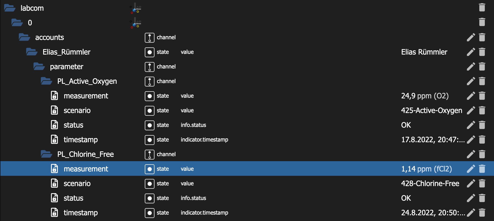

```diff
! Support for PoolLAB 2.0 will follow.
```

---


# ioBroker.labcom

### 0.1.4
* Measurement values are converted explicit to number, OR and UR measurements get NaN as value and __new status state__ (Overrange, Underrange, OK)


## Description
This adapter fetches your latest measurements from labcom.cloud



## Usage
* Install this adapter to ioBroker (Expert mode -> install from url)
* Create an instance of this adapter
* Enter your LabCom API token, which can be created on https://labcom.cloud/pages/user-setting
* Define which accounts should be monitored in ioBroker (either enter "0" for all accounts, or enter the desired account IDs comma separated)
* The adapter is preconfigured to fetch the latest data every minute, this can be changed in the instance overview

## Changelog
* 0.0.1 Inital release (LemonShock)
* 0.0.2 Incomplete config patch (LemonShock)
* 0.0.3 Added translations, restructured data points (LemonShock)
* 0.1.1 Forked from 0.0.1 (LemonShock), change of the state datatype to __number__
* 0.1.2 Update libraries and io-package.json
* 0.1.3 Update LabCom Cloud endpoint URL
* 0.1.4 Measurement are values converted explicit to number, OR and UR measurements get NaN as value and __new status state__ (Overrange, Underrange, OK)


## Community
* [ioBroker Community - Poollab / Primelab integrieren](https://forum.iobroker.net/topic/34360/poollab-primelab-integrieren)
* [Poolpowershop-Forum - ioBroker Adapter für das PoolLAB](https://www.poolpowershop-forum.de/forum/thread/1159304-iobroker-adapter-für-das-poollab/)

## Credits
This app is made possible by contributions from:
* [@LemonShock](https://github.com/LemonShock) - core contributor [LemonShock/ioBroker.labcom](https://github.com/LemonShock/ioBroker.labcom)
* [Elias Rümmler](http://www.100prznt.de) ([@100prznt](https://github.com/100prznt))
* [@Tw1nh3ad](https://github.com/Tw1nh34d)


## License
The ioBroker.labcom Adapter is licensed under [MIT](http://www.opensource.org/licenses/mit-license.php "Read more about the MIT license form"). Refer to [LICENSE](https://github.com/100prznt/ioBroker.labcom/blob/master/LICENSE) for more information.

## Contributions
Contributions are welcome. Fork this repository and send a pull request if you have something useful to add.

-----------

Copyright &copy; 2022 Elias Ruemmler <pool@100prznt.de>
